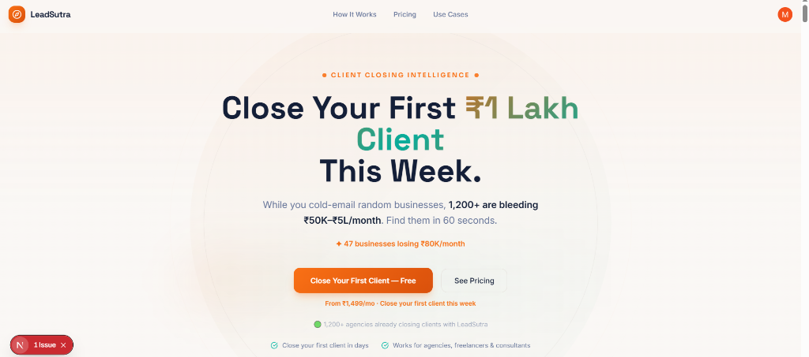

# LeadSutra Clone



A modern, high-performance landing page and client discovery platform clone built for marketing agencies and freelancers.

## 🚀 Overview

This project is a fully responsive, heavily animated landing page clone of LeadSutra. I built this to demonstrate my ability to work with modern React frameworks, strict TypeScript configurations, and secure authentication flows.

## 🛠️ Tech Stack

I chose a highly modern, industry-standard stack for this project:

- **Framework**: [Next.js 15](https://nextjs.org/) (App Router)
- **Library**: [React 19](https://react.dev/)
- **Language**: TypeScript (Strict mode enabled)
- **Styling**: [Tailwind CSS](https://tailwindcss.com/)
- **Authentication**: [Clerk](https://clerk.com/)
- **Code Quality**: ESLint, Prettier

## 💡 How I Built It

### 1. Architecture & UI Development
I broke down the complex landing page into modular, reusable sections (`HeroSection`, `FeaturesSection`, `PricingSection`, `TestimonialsSection`, etc.) inside the `src/components/` directory. This kept the main `page.tsx` extremely clean and readable. 

For the styling, I relied heavily on Tailwind CSS to create the glassmorphism effects (`backdrop-blur`), subtle gradients, and complex responsive grid layouts.

### 2. Strict Type Safety & Code Quality
I made sure the project adhered to Next.js 15's strict linting rules. During development, I had to fix several hydration issues, unnecessary escape characters, and TypeScript `any` type warnings. I also added a global CSS type declaration to prevent module resolution errors with custom stylesheets.

### 3. Authentication Flow
I integrated Clerk for identity management. Instead of building a custom auth flow from scratch, I used the Clerk CLI to scaffold the environment. 
I customized the Navbar to render different states depending on whether the user is logged in or out using Clerk's `<Show>` component. 
For a polished UX, I intercepted all the placeholder 404 links (like `/about` or `/marketplace`) in `not-found.tsx` to automatically redirect users to `/sign-in` if they are logged out, or back to the home page if they are authenticated.

## 🤖 How I Used AI in My Workflow

I heavily leveraged AI as a pair-programmer throughout this build. Here's exactly how it helped:

- **Component Generation & Scaffolding**: I used AI to rapidly scaffold the initial boilerplate for complex sections (like the animated testimonial carousels and pricing grids).
- **Refactoring & Debugging**: At one point, I accidentally duplicated a large chunk of code in `Navbar.tsx` which threw a bunch of TypeScript identifier errors. I used AI to quickly spot the duplication, truncate the file safely, and get the build passing again.
- **Linting & Formatting**: I used AI to bulk-fix tedious Next.js 15 ESLint errors (like `no-useless-escape` in my copy) and correctly format the codebase using Prettier.
- **Auth Integration**: When integrating Clerk, I worked with the AI to quickly swap out my static `<a>` tags with Clerk's `<SignInButton>` and `<SignUpButton>` components, and it helped me implement the clever 404 redirect logic based on the user's auth state.

AI didn't build the project for me, but it acted as an incredibly fast senior engineer sitting next to me—handling the boilerplate and spotting my typos so I could focus on the architecture, business logic, and UX.

## 🚀 Getting Started

1. Clone the repository and install dependencies:
   ```bash
   npm install
   ```
2. Make sure you have your Clerk environment variables configured in `.env` (or `.env.local`):
   ```
   NEXT_PUBLIC_CLERK_PUBLISHABLE_KEY=your_key
   CLERK_SECRET_KEY=your_secret
   ```
3. Start the dev server:
   ```bash
   npm run dev
   ```
4. Open [http://localhost:4028](http://localhost:4028).